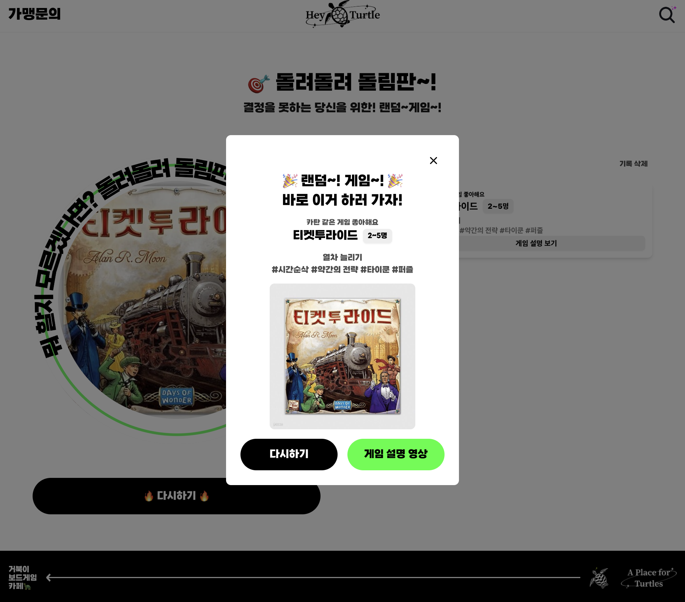
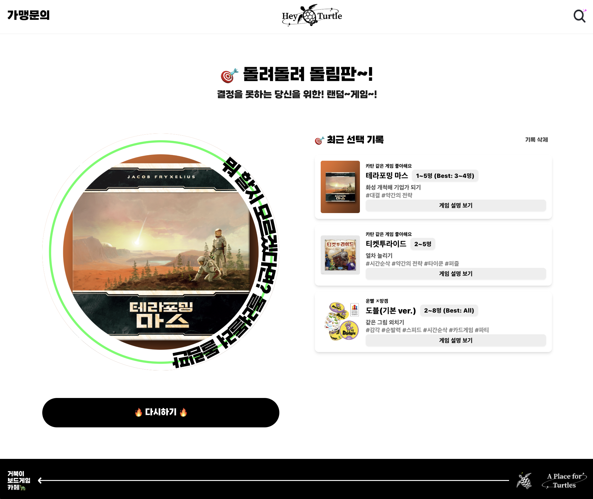

# 🎲 거북이 보드게임 카페 - 돌려돌려 돌림판

이 프로젝트는 사용자가 선택할 수 있는 여러 게임 중에서 랜덤하게 게임을 추천해주는 웹 애플리케이션입니다. 게임을 고르기 어려운 상황에서 버튼 클릭 한 번으로 재미있는 게임을 추천받을 수 있습니다. 추천된 게임에 대한 설명과 관련된 영상도 제공되며, 사용자는 선택 기록을 확인하거나 삭제할 수 있는 기능을 제공합니다.

## 📸 주요 기능

1. **🎯 랜덤 게임 선택**

   - "🔥 멈추기 🔥" 버튼을 클릭하면 게임 목록에서 하나의 게임을 랜덤하게 추천합니다.
   - 추천되는 동안 애니메이션 효과로 사용자의 관심을 유도합니다.

2. **📜 게임 선택 기록**

   - 사용자가 선택한 게임은 기록으로 저장됩니다.
   - 최근 선택한 10개의 게임을 로컬 스토리지를 통해 확인할 수 있습니다.

3. **🎥 게임 설명 및 영상**

   - 추천된 게임에 대한 설명, 장르, 인원 수 등의 정보를 제공합니다.
   - 관련된 영상이 있을 경우, 버튼을 통해 게임의 설명 영상을 시청할 수 있습니다.

4. **🔄 게임 목록 업데이트**

   - Airtable에서 게임 목록을 동적으로 받아와 업데이트합니다.
   - 각 게임은 이미지, 설명, 장르, 추천 인원 수, 영상 링크 등의 정보가 포함되어 있습니다.

5. **💻 사용자 친화적인 UI 디자인**

   - 직관적이고 깔끔한 디자인으로 사용자 경험(UX)을 최적화하였습니다.
   - 애니메이션과 직관적인 버튼으로 쉽게 사용할 수 있습니다.

6. **🧹 기록 삭제 기능**
   - "기록 삭제" 버튼을 눌러 최근 선택한 게임 목록을 모두 삭제할 수 있습니다.

---

## ⚙️ 설치 및 실행 방법

### 1. 저장소 클론

먼저 이 저장소를 클론합니다:

```bash
git clone https://github.com/your-username/random-game-picker.git
```

### 2. 패키지 설치

프로젝트 디렉토리로 이동 후, 필요한 패키지를 설치합니다:

```bash
cd random-game-picker
npm install
```

### 3. 환경 변수 설정

`.env` 파일을 생성하고, Airtable API 키와 데이터베이스 정보를 추가합니다:

- `REACT_APP_AIRTABLE_API_KEY`: Airtable API 키
- `REACT_APP_AIRTABLE_BASE_ID`: Airtable Base ID
- `REACT_APP_AIRTABLE_TABLE_NAME`: Airtable 테이블 이름

### 4. 개발 서버 실행

로컬 개발 서버를 실행합니다:

```bash
npm start
```

이제 [http://localhost:3000](http://localhost:3000)에서 애플리케이션을 확인할 수 있습니다.

---

## 🚀 주요 기능 및 화면

1. **랜덤 게임 선택**:
   

   - "🔥 멈추기 🔥" 버튼을 클릭하여 랜덤으로 게임을 추천받습니다.
   - 추천된 게임에 대한 설명을 확인하고, 관련 영상이 있다면 시청할 수 있습니다.

2. **선택 결과 팝업**:
   

   - 게임을 랜덤으로 선택하고, 선택된 게임에 대한 상세 정보를 제공합니다.

3. **게임 선택 기록 확인**:
   

   - "🎯 최근 선택 기록" 섹션에서 최근 선택한 게임들의 목록을 확인할 수 있습니다.
   - 선택한 게임은 10개까지 저장되며, 저장된 게임은 이미지와 설명도 함께 제공됩니다.

4. **애니메이션 효과**:

   - 게임 목록을 순차적으로 회전하는 **애니메이션**을 통해 시각적인 재미를 추가합니다. 🔄

5. **게임 정보**:
   - 각 게임은 **이미지**, **설명**, **장르**, **인원수**, **게임 링크** 등의 정보를 포함합니다. 📜

---

## 🛠️ 기술 스택

- **React**: 프론트엔드 애플리케이션을 구축하기 위한 JavaScript 라이브러리입니다.
- **Airtable**: 게임 목록과 관련 정보를 관리하는 데이터베이스 서비스.
- **Axios**: HTTP 요청을 보내기 위한 클라이언트 라이브러리.
- **Tailwind CSS**: 빠르고 효율적인 스타일링을 위한 유틸리티 기반 CSS 프레임워크.
- **React Hooks**: 상태 관리 및 생명주기 관리를 위한 최신 React 기능 (useState, useEffect 등).
- **JavaScript (ES6+)**: 최신 ECMAScript 기능들을 활용한 효율적인 코드 작성.
- **HTML5 & CSS3**: 웹 페이지 구조 및 스타일을 담당합니다.

---

## 폴더 구조 📂

```
/src
  /components
    Footer.js       # 푸터 컴포넌트
    Navbar.js       # 네비게이션 바 컴포넌트
  App.js            # 메인 애플리케이션 컴포넌트
  /assets
    navbar_heyTurtle.png   # 게임 로고 이미지
    navbar_search.png           # 검색 아이콘 이미지
    circular-guide.png   # 회전 가이드 이미지
    ...
  .env               # 환경 변수 설정 파일
  package.json       # 프로젝트 설정 파일
  README.md          # 프로젝트 설명 파일
```

---

## 개발자 💻

- **프로젝트 작성자**: [ddah0329](https://github.com/ddah0329)
- **이메일**: ddah0329m@gmail.com

---

## 📜 라이선스

이 프로젝트는 **거북이 보드게임 카페 건대점**에 라이선스가 있으므로 금전적으로 무단 사용은 불가합니다!
